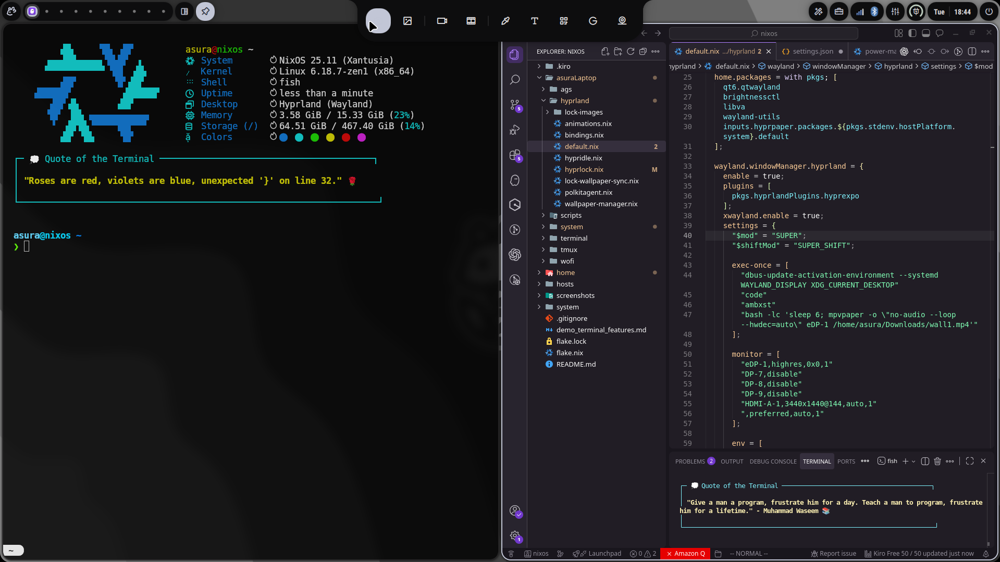

# 🚀 Asura's NixOS Laptop Configuration

*"Because life's too short for broken configs and ugly desktops"* 😎

A meticulously crafted NixOS configuration that actually works™️. Built with love, caffeine, and an unhealthy obsession with dotfiles.

## 📸 Screenshots




## 🏗️ System Architecture

```
nixos-laptop/
├── 📁 asuraLaptop/          # Main system configuration
│   ├── 🎨 hyprland/         # Wayland compositor setup
│   ├── 🖥️  system/          # Core system modules
│   ├── 📜 scripts/          # Custom automation scripts
│   └── 🎭 ags/              # Desktop widgets & panels
├── 🏠 home/                 # Home Manager configuration
│   ├── 🐚 shell/            # Fish shell + Starship prompt
│   ├── �e️  desktop/         # GTK theming & desktop apps
│   ├── 💻 vscode/           # Kiro IDE configuration
│   └── 📦 templates/        # Direnv project templates
├── 🌐 hosts/               # Host-specific configurations
└── 📋 flake.nix            # The magic happens here
```

**What makes this special?**
- 🎯 **Modular Design**: Each component is isolated and reusable
- 🔥 **Stylix Integration**: System-wide theming that doesn't suck
- ⚡ **Performance Optimized**: Because waiting is for peasants
- 🛠️ **Developer Friendly**: Direnv, modern CLI tools, and sanity
- 🎨 **Actually Pretty**: Dark theme that won't burn your retinas

## 🧠 Ambxst AI (Cloud + Local)

**Default model:** `gpt-4o-mini`  
**Auto fallback:** If OpenAI hits rate limits and Gemini is available, Ambxst switches to Gemini automatically.

**Set API keys (recommended)**
- In Ambxst chat, run: `/key openai sk-...`
- Optional Gemini fallback: `/key gemini <key>`
- Keys are stored in `~/.config/Ambxst/config/ai.json`

**If key saving fails (permission denied)**
```bash
sudo chown -R $USER:$USER ~/.config/Ambxst
```

**Local AI (LM Studio)**
- Guide: `/home/asura/Downloads/AMBXST_LMSTUDIO_GUIDE.md`
- Config files:
  - `/etc/nixos/asuraLaptop/ambxst/modules/services/ai/litellm_config.yaml`
  - `/etc/nixos/asuraLaptop/ambxst/ai.json` (repo defaults)
  - `~/.config/Ambxst/config/ai.json` (user overrides)

## 🖼️ Ambxst Wallpapers

**Wallpaper config file (user state):**
- `~/.local/share/Ambxst/wallpapers.json`

Key fields inside:
- `wallPath`: directory Ambxst scans for wallpapers
- `currentWall`: full path to the selected wallpaper

**Recommended folder:**
- `~/Pictures/Wallpapers`

**How to set it**
1. Put your wallpapers in `~/Pictures/Wallpapers`.
2. Open the Ambxst wallpaper UI:
   - Keybind: `SUPER` + `,` (comma), or run `ambxst run dashboard-wallpapers`.
3. Set the wallpaper directory and pick a wallpaper.

**Manual edit (if you prefer)**
Edit `~/.local/share/Ambxst/wallpapers.json` and set:
```
"wallPath": "/home/asura/Pictures/Wallpapers",
"currentWall": "/home/asura/Pictures/Wallpapers/your-image.png"
```

Supported types: `jpg`, `png`, `webp`, `gif`, `mp4`, `webm`, `mkv`.

## 🚀 Quick Setup (Flake Workflow)

### 0) Prerequisites
```bash
# Enable flakes in /etc/nixos/configuration.nix
nix.settings.experimental-features = [ "nix-command" "flakes" ];
```

### 1) Install Git (if not already)
```bash
nix-shell -p git
```

### 2) Clone This Repo
```bash
git clone https://github.com/Valo-Asura/hyprNixos /etc/nixos
cd /etc/nixos
```

### 3) Replace Hardware Config
```bash
sudo nixos-generate-config --show-hardware-config > asuraLaptop/system/hardware-configuration.nix
```

### 4) Update Host/User (if needed)
Edit `hosts/default.nix` if your hostname/username differ.

### 5) Build & Switch
```bash
sudo nixos-rebuild switch --flake /etc/nixos#nixos
```

### 6) Reboot
```bash
sudo reboot
```

## 🎭 Replicating This Setup

### For Other NixOS Systems
1. **Fork this repo** (because copying is caring)
2. **Update hardware-configuration.nix** with your hardware
3. **Modify hosts/default.nix** with your hostname/username
4. **Adjust asuraLaptop/** folder name to match your setup
5. **Tweak theming.nix** if you hate Gruvbox (but why would you?)
6. **Run `rebuild`** and pray to the Nix gods

### For Non-NixOS Systems
*"Why would you do this to yourself?"* 🤔
- Use Home Manager standalone
- Copy the `home/` directory structure
- Install packages manually (like a caveman)
- Cry because it's not as elegant

## � Tearminal & Shell Setup

### 🎨 Kitty Terminal Features
- **Font**: JetBrainsMono Nerd Font (15pt) + FiraCode Nerd Font
- **Size**: 120 columns × 25 rows (optimized for productivity)
- **Style**: Powerline tabs with round edges
- **Theme**: Gruvbox dark with 92% opacity
- **Cursor**: Trail effect for better visibility

### ⚡ Enhanced Fish Shell
- **Starship Prompt**: Gruvbox-themed with Git & direnv indicators
- **Smart Tools**:
  - `atuin` - AI-powered shell history
  - `zoxide` - Smart cd replacement (`z` command)
  - `fzf` - Fuzzy finder integration
  - `eza` - Modern ls with icons & Git status
  - `bat` - Syntax-highlighted cat
  - `ripgrep` - Fast grep replacement
- **Fun Quotes**: Random developer/tech quotes on terminal startup
- **Motivational System**: Context-aware quotes for different coding moods

### 🚀 Quick Commands
```bash
ff                   # FastFetch system info
z <directory>        # Smart directory jumping
ctrl+r               # Atuin history search (in terminal)
quote                # Random fun quote
qotd                 # Quote of the day
motivate <mood>      # Motivational quotes (debug/frustrated/tired/confident)
```

## 🖼️ Wallpaper Management

### Change Wallpaper
```bash
hyprctl hyprpaper wallpaper "eDP-1,/path/to/image.jpg"    # Set wallpaper for main display
hyprctl hyprpaper wallpaper ",/path/to/image.jpg"         # Set for all displays
```

### Live Wallpaper
```bash
swww init                                                  # Initialize live wallpaper daemon
swww img /path/to/image.jpg                               # Set static image
swww img /path/to/video.mp4                               # Set video as wallpaper
```

## 🔧 System Commands

### Enhanced System Info
```bash
sysinfo              # Detailed system information
microfetch-custom    # Enhanced microfetch (alias: mf)
thermal-status       # Thermal management status
```

### Project Management
```bash
init-project <name> <type>  # Create new project with direnv
init-envrc <template>       # Add .envrc to existing project
mkcd <directory>            # Create and enter directory
```

### Development Shortcuts
```bash
rebuild              # nixos-rebuild switch --flake .
update               # nix flake update
clean                # nix-collect-garbage -d
code                 # Launch Kiro
```

## 🤖 Ambxst + OpenClaw AI

If you want the AI dashboard working out of the box (Ambxst → LiteLLM → OpenClaw), follow:

`docs/AMBXST_OPENCLAW_GUIDE.md`

## 🧩 Ambxst Keybinds

Thanks to Ambxst for the beautiful QuickShell config.

### Dashboard
| Keybind | Action |
| --- | --- |
| `SUPER+A` | Dashboard Assistant |
| `SUPER+V` | Dashboard Clipboard |
| `SUPER+.` | Dashboard Emoji |
| `SUPER+N` | Dashboard Notes |
| `SUPER+T` | Dashboard Tmux |
| `SUPER+,` | Dashboard Wallpapers |
| `SUPER` (hold) | Dashboard Widgets (hold) |

### System
| Keybind | Action |
| --- | --- |
| `SUPER+SHIFT+C` | Ambxst Config |
| `SUPER+SHIFT+A` | Ambxst Lens |
| `SUPER+L` | Lock Screen |
| `SUPER+TAB` | Overview |
| `SUPER+ESC` | Power Menu |
| `SUPER+CTRL+ALT+B` | Ambxst Quit |
| `SUPER+ALT+B` | Ambxst Reload |
| `SUPER+SHIFT+R` | Screen Record |
| `SUPER+SHIFT+S` | Screenshot |
| `SUPER+S` | Tools |

### Window & Workspace
| Keybind | Action |
| --- | --- |
| `SUPER+C` | Close Window |
| `SUPER+1..0` | Switch to Workspace 1..10 |
| `SUPER+SHIFT+1..0` | Move Window to Workspace 1..10 |
| `SUPER+V` | Previous Workspace |
| `SUPER+X` | Next Workspace |
| `SUPER+SHIFT+Z` | Previous Occupied Workspace |
| `SUPER+SHIFT+X` | Next Occupied Workspace |
| `SUPER+Scroll Down` | Previous Occupied Workspace |
| `SUPER+Scroll Up` | Next Occupied Workspace |
| `SUPER+SHIFT+V` | Toggle Special Workspace |
| `SUPER+ALT+V` | Move Window to Special Workspace |

### Focus & Move
| Keybind | Action |
| --- | --- |
| `SUPER+Up` / `SUPER+CTRL+K` | Focus Up |
| `SUPER+Down` / `SUPER+CTRL+J` | Focus Down |
| `SUPER+Left` / `SUPER+CTRL+H` | Focus Left |
| `SUPER+Right` / `SUPER+CTRL+L` | Focus Right |
| `SUPER+SHIFT+Up` / `SUPER+SHIFT+K` | Move Window Up |
| `SUPER+SHIFT+Down` / `SUPER+SHIFT+J` | Move Window Down |
| `SUPER+SHIFT+Left` / `SUPER+SHIFT+H` | Move Window Left |
| `SUPER+SHIFT+Right` / `SUPER+SHIFT+L` | Move Window Right |
| `SUPER+Mouse Left` | Drag Window |
| `SUPER+Mouse Right` | Resize Window |

### Resize & Layout
| Keybind | Action |
| --- | --- |
| `SUPER+ALT+Left` / `SUPER+ALT+H` | Resize Horizontal - |
| `SUPER+ALT+Right` / `SUPER+ALT+L` | Resize Horizontal + |
| `SUPER+ALT+Up` / `SUPER+ALT+K` | Resize Vertical - |
| `SUPER+ALT+Down` / `SUPER+ALT+J` | Resize Vertical + |
| `SUPER+ALT+SPACE` | Promote (Scrolling) |
| `SUPER+CTRL+SPACE` | Toggle Fit (Scrolling) |
| `SUPER+SHIFT+SPACE` | Toggle Full Column (Scrolling) |
| `SUPER+ALT+CTRL+Left` / `SUPER+ALT+CTRL+H` | Swap Column Left |
| `SUPER+ALT+CTRL+Right` / `SUPER+ALT+CTRL+L` | Swap Column Right |
| `SUPER+CTRL+ALT+1..0` | Move Column to Workspace 1..10 |

### Media & Hardware
| Keybind | Action |
| --- | --- |
| `XF86AudioPlay` / `XF86AudioMedia` | Play/Pause |
| `XF86AudioPrev` | Previous Track |
| `XF86AudioNext` | Next Track |
| `XF86AudioStop` | Stop |
| `XF86AudioRaiseVolume` | Volume Up |
| `XF86AudioLowerVolume` | Volume Down |
| `XF86AudioMute` | Mute |
| `XF86MonBrightnessUp` | Brightness Up |
| `XF86MonBrightnessDown` | Brightness Down |
| `XF86Calculator` | Calculator |
| `Lid Close` | Lock Session |
| `Lid Close (on)` | Display Off |
| `Lid Open (off)` | Display On |

### Power & Thermal
```bash
power-status         # Check power management status
power-optimize       # Optimize settings based on AC/battery
thermal-monitor      # Real-time thermal monitoring
acpi-diagnostics     # Diagnose ACPI/EC issues
```

### Fun & Productivity
```bash
quote                # Random developer quote
qotd                 # Quote of the day
motivate <mood>      # Motivational quotes (debug/frustrated/tired/confident)
fix-nemo-thumbnails  # Fix file manager thumbnail permissions
restart-nemo         # Restart Nemo file manager
```

## 🎯 Features That Actually Matter

- **🔥 Stylix Theming**: Consistent dark theme across everything (including browsers!)
- **⚡ Direnv Integration**: Automatic environment management
- **🐚 Enhanced Shell**: Fish + Starship + modern CLI tools + fun quotes
- **🛠️ Developer Tools**: Kiro IDE, nixfmt, language servers
- **🌡️ Thermal Management**: Because laptops shouldn't be space heaters
- **🔋 Power Optimization**: Battery life that doesn't suck
- **🎨 Hyprland**: Wayland compositor that actually works
- **📁 File Management**: Nemo with working thumbnails (no more permission errors!)
- **🌐 Browser Theming**: Dark theme for Zen browser and Firefox
- **💭 Fun Quotes**: Random developer wisdom to brighten your terminal

## 🤝 Contributing

Found a bug? Want to add something cool? PRs welcome!

*"Just don't break my beautiful config, please"* 🙏

---

*Made with ❤️, lots of ☕, and probably too much 🍕*
