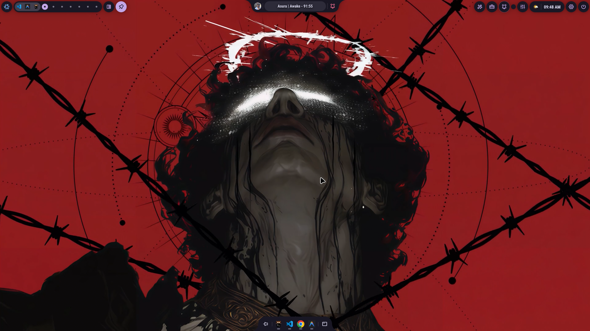

# Asura NixOS Flake

> [!WARNING]
> **EXPERIMENTAL, HIGHLY BREAKABLE, AND AI-CODED**
> This repository contains a highly customized NixOS configuration flake that is actively developed and maintained using AI agents. It is prone to breaking changes and is optimized specifically for the my hardware. Use at your own risk.

---

## Showcase

| Desktop Workspace | Lockscreen |
| :--- | :--- |
|  |  |

---

## Install

1. **Install Git & Enable Flakes**:
   ```bash
   nix-shell -p git
   sudo mkdir -p /etc/nix
   echo "experimental-features = nix-command flakes" | sudo tee /etc/nix/nix.conf
   ```

2. **Clone the Flake**:
   ```bash
   sudo rm -rf /etc/nixos
   sudo git clone https://github.com/Valo-Asura/hyprNixos.git /etc/nixos
   cd /etc/nixos
   ```

2. **Generate Host Hardware Config**:
   ```bash
   sudo nixos-generate-config --show-hardware-config > /etc/nixos/asuraPc/system/hardware-configuration.nix
   ```

3. **Rebuild and Switch**:
   ```bash
   sudo nixos-rebuild switch --flake /etc/nixos#nixos
   ```

---

## Key Configurations

* **Desktop Environment**: Hyprland window manager paired with **Vibeshell** (a custom QML/Quickshell bar, notch, and control dashboard).
* **Unified Memory**: Integrated filesystem and SQLite memory databases (`history.db`) synchronized automatically across Zed (`context_servers`), VS Code (`mcp.json`), Cursor (`global.mdc`), Codex (`config.toml`), and Kiro.
* **Wallpaper Engine**: Robust component that uses a timer-based process lifecycle in QML to seamlessly swap static wallpapers (`hyprpaper`) and video wallpapers (`mpvpaper`) with automatic pywal color generation.
* **Local Services**: Local developer database engines (MySQL 8.4 and MongoDB with WiredTiger cache size constraints to prevent out-of-memory errors).

---

## Repository Structure

```text
/etc/nixos
├── hosts/              # Machine host declarations
├── asuraPc/
│   ├── system/         # Core system services, drivers, and packages
│   ├── hyprland/       # Window manager bindings, lockscreen, and rules
│   └── vibeshell/      # QML/Quickshell user interface modules
├── home/               # User-level Home Manager configurations
└── docs/               # System documentation and validation guides
```

---

## Thanks

Special thanks to the Hyprland, Quickshell/Axenide-Ambxst, and NixOS communities.
