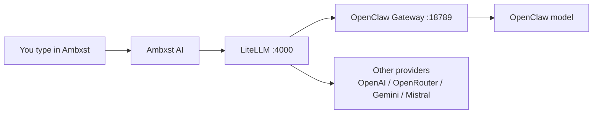
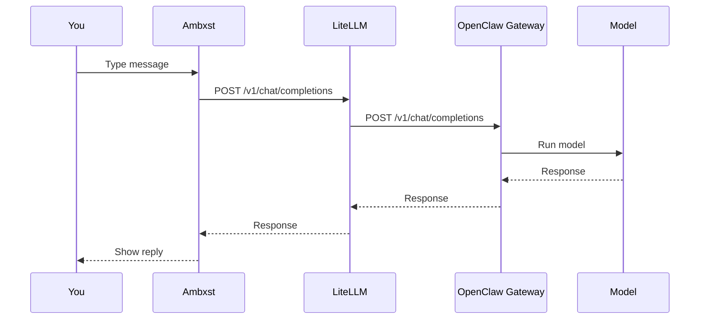

# Ambxst + OpenClaw AI Guide (Noob Friendly)

This guide shows how Ambxst AI works in this repo, how to configure keys, and how to connect it to OpenClaw via LiteLLM.

**What you get**
- Ambxst dashboard AI chat.
- LiteLLM proxy in the middle so multiple providers work the same way.
- OpenClaw gateway for an OpenAI‑compatible endpoint.

## Big Picture



## Quick Start

1. Edit the encrypted secrets file.

```bash
nix shell nixpkgs#sops -c sops /etc/nixos/asuraLaptop/secrets/ambxst-ai.yaml
```

2. Put real keys in these fields:

`OPENCLAW_GATEWAY_TOKEN`, `OPENAI_API_KEY`, `OPENROUTER_API_KEY`, `GEMINI_API_KEY`, `MISTRAL_API_KEY`, `GITHUB_TOKEN`

3. Rebuild.

```bash
sudo nixos-rebuild switch --flake /etc/nixos
```

4. Log out and back in.

5. Check OpenClaw is running.

```bash
systemctl --user status openclaw-gateway
```

6. Check LiteLLM is running (Ambxst starts it when Ambxst launches).

7. Test the model list.

```bash
curl -s http://127.0.0.1:4000/v1/models | rg openclaw
```

## Key Files You Can Edit

- Ambxst AI defaults: `/etc/nixos/asuraLaptop/ambxst/config/defaults/ai.js`
- Ambxst AI config used at runtime: `/etc/nixos/asuraLaptop/ambxst/ai.json`
- LiteLLM models list: `/etc/nixos/asuraLaptop/ambxst/modules/services/ai/litellm_config.yaml`
- OpenClaw config: `~/.openclaw/openclaw.json`

## Common Tasks

### Change the default model

1. Edit `/etc/nixos/asuraLaptop/ambxst/ai.json`.
2. Change `defaultModel`.
3. Rebuild.

### Add a new provider to LiteLLM

1. Edit `/etc/nixos/asuraLaptop/ambxst/modules/services/ai/litellm_config.yaml`.
2. Add a new `model_name` entry.
3. Rebuild.

### Verify the OpenClaw gateway

1. Check the port.

```bash
ss -ltnp | rg 18789
```

2. Test the OpenAI chat endpoint.

```bash
curl -s http://127.0.0.1:18789/v1/models -H "Authorization: Bearer $(cat /run/secrets/OPENCLAW_GATEWAY_TOKEN)"
```

## Troubleshooting

### “API Key missing” error

1. Ensure the secret exists.

```bash
ls -l /run/secrets/OPENCLAW_GATEWAY_TOKEN
```

2. Restart Ambxst so it reloads secrets.

### LiteLLM not running

1. Restart Ambxst.

```bash
ambxst quit
ambxst
```

2. Check the log.

```bash
tail -n 80 /tmp/litellm.log
```

### OpenClaw gateway not running

1. Check the service.

```bash
systemctl --user status openclaw-gateway
```

2. Restart the service.

```bash
systemctl --user restart openclaw-gateway
```

## How it is wired (simple diagram)


